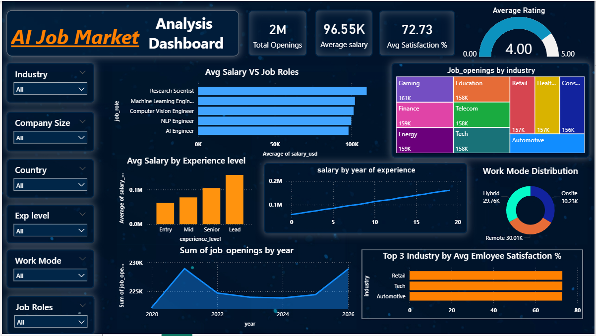

# 🤖 AI Job Market Analysis Dashboard

## 📌 Project Overview
The **AI Job Market Analysis Dashboard** is a data analytics project built using **Power BI** to explore trends in the Artificial Intelligence job market.  

This dashboard provides insights into **job openings, salary trends, employee satisfaction, industry demand, and work modes**. It helps understand how AI careers are evolving across industries and experience levels.

The project demonstrates the use of **data visualization and analytical insights** to interpret job market patterns.

---

## 🎯 Project Objectives

- Analyze **AI job openings across industries**
- Compare **average salaries for different AI job roles**
- Study **salary growth based on experience level**
- Identify **industry demand for AI professionals**
- Analyze **remote, hybrid, and onsite work trends**
- Understand **employee satisfaction across industries**

---

## 🛠️ Tools & Technologies Used

| Tool | Purpose |
|-----|------|
| **Power BI** | Dashboard creation and visualization |
| **Power Query** | Data cleaning and transformation |
| **DAX** | Calculated measures and KPIs |
| **Data Modeling** | Creating relationships between tables |

---

## 📊 Key Dashboard Metrics

| KPI | Value |
|----|----|
| **Total Job Openings** | 2M |
| **Average Salary** | $96.55K |
| **Average Satisfaction Score** | 72.73% |
| **Average Rating** | 4.0 / 5 |

These metrics provide a quick overview of the **current AI job market landscape**.

---

## 📈 Dashboard Insights

### 1️⃣ Average Salary vs Job Roles
The dashboard compares salaries across major AI roles.

Key observations:
- **Research Scientists** receive the highest salary.
- **Machine Learning Engineers** and **Computer Vision Engineers** have competitive salaries.
- **NLP Engineers** and **AI Engineers** follow closely.

This shows that **specialized AI roles are highly valued in the job market**.

---

### 2️⃣ Job Openings by Industry
The analysis shows strong demand for AI professionals across industries such as:

- Gaming
- Finance
- Energy
- Telecom
- Tech
- Automotive
- Retail
- Education

These industries are increasingly adopting **AI technologies to improve business operations and innovation**.

---

### 3️⃣ Salary by Experience Level
The dashboard reveals that salary increases significantly with experience.

| Experience Level | Salary Trend |
|---|---|
| Entry | Lower salary range |
| Mid | Moderate growth |
| Senior | High salary levels |
| Lead | Highest salary packages |

This indicates that **experience plays a major role in salary growth in AI careers**.

---

### 4️⃣ Salary Growth by Years of Experience
The salary trend chart shows a **steady increase in salary with years of experience**.

Professionals with **10+ years of experience** earn significantly higher salaries compared to entry-level professionals.

---

### 5️⃣ Work Mode Distribution
AI jobs offer flexible work environments:

- **Onsite Jobs** – 30K
- **Remote Jobs** – 30K
- **Hybrid Jobs** – 29K

This indicates that **remote and hybrid work opportunities are widely available in the AI industry**.

---

### 6️⃣ Job Openings Trend by Year
The yearly trend analysis shows fluctuations in job openings between **2020 and 2026**, with a general increase in recent years.

This reflects the **rapid growth and adoption of AI technologies worldwide**.

---

### 7️⃣ Top Industries by Employee Satisfaction
Industries with the highest employee satisfaction include:

1. Retail  
2. Tech  
3. Automotive  

These sectors provide **better workplace environments and job satisfaction for AI professionals**.

---

## 🎛️ Dashboard Features

The dashboard includes interactive filters that allow users to explore data dynamically:

- Industry Filter
- Company Size Filter
- Country Filter
- Experience Level Filter
- Work Mode Filter
- Job Role Filter

These features make the dashboard **interactive and user-friendly**.

---

## 📷 Dashboard Preview

---

## 📌 Key Takeaways

- AI job opportunities are growing rapidly across industries.
- Specialized roles such as **Research Scientists and ML Engineers** receive the highest salaries.
- Experience significantly impacts salary growth.
- Remote and hybrid jobs are becoming common in AI careers.
- Tech and retail industries show strong employee satisfaction levels.

---

## 🧠 Conclusion
The **AI Job Market Analysis Dashboard** provides valuable insights into AI job trends using data visualization techniques. It highlights salary patterns, industry demand, work modes, and employee satisfaction in the AI sector.

This project demonstrates the ability to **analyze datasets and present meaningful insights through interactive dashboards**.

---

## 👩‍💻 Author

**Anurag Jarwal**  
B.Tech – Computer Science Engineering  

🔗 GitHub:  
https://github.com/anuragjarwal767

---
