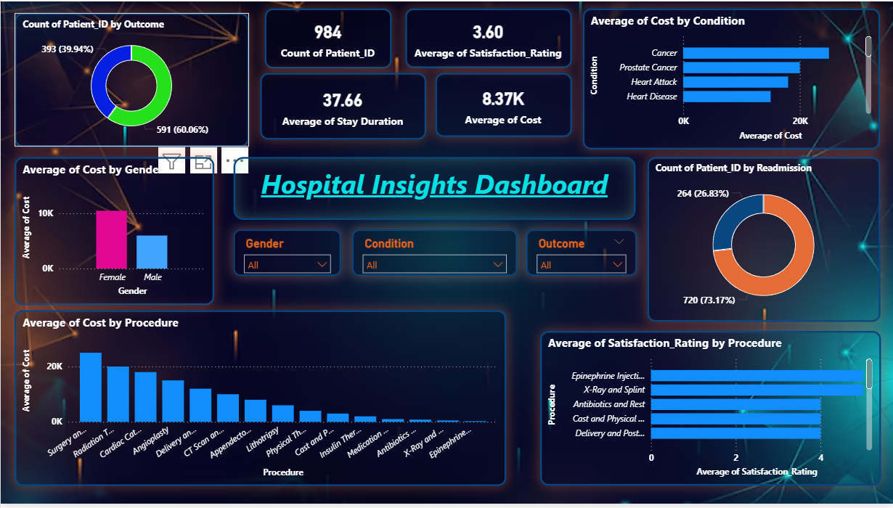

# 🏥 Hospital Insights Dashboard – Data Analytics Report

## 📊 Project Overview
The **Hospital Insights Dashboard** is designed to analyze hospital data and generate meaningful insights related to patient outcomes, treatment costs, patient satisfaction, and hospital readmission rates.  

This dashboard helps healthcare administrators understand operational performance and make **data-driven decisions** to improve hospital services.

---

## 🎯 Objectives
The main objectives of this dashboard are:

- To analyze **patient treatment outcomes**
- To evaluate **average treatment cost by medical condition**
- To measure **patient satisfaction ratings**
- To analyze **hospital readmission patterns**
- To understand **cost differences by gender and medical procedures**

---

## 🛠 Tools & Technologies
- **Power BI** – Dashboard creation and visualization  
- **Power Query** – Data cleaning and transformation  
- **DAX (Data Analysis Expressions)** – Data modeling and calculations  
- **Dataset** – Hospital / Healthcare dataset  

---

## 📌 Key Performance Indicators (KPIs)

| Metric | Value |
|------|------|
| Total Patients | 984 |
| Average Satisfaction Rating | 3.60 |
| Average Stay Duration | 37.66 Days |
| Average Treatment Cost | 8.37K |

These KPIs provide a quick overview of the hospital's overall performance.

---

## 📈 Dashboard Analysis & Insights

### 1️⃣ Patient Outcome Distribution
The donut chart shows the distribution of patient outcomes.

- **Successful/Positive Outcomes:** 591 patients (60.06%)
- **Other Outcomes:** 393 patients (39.94%)

**Insight:**  
A majority of patients experienced successful treatment outcomes, indicating effective healthcare services.

---

### 2️⃣ Average Cost by Condition
This chart compares treatment costs across different medical conditions.

| Condition | Observation |
|-----------|-------------|
| Cancer | Highest treatment cost |
| Prostate Cancer | Second highest |
| Heart Attack | Moderate cost |
| Heart Disease | Lower cost |

**Insight:**  
Cancer treatments contribute significantly to hospital expenses.

---

### 3️⃣ Average Cost by Gender
The visualization compares treatment costs between male and female patients.

| Gender | Observation |
|------|-------------|
| Female | Higher average treatment cost |
| Male | Lower average treatment cost |

**Insight:**  
Female patients show slightly higher treatment costs on average, which may depend on treatment type and medical condition.

---

### 4️⃣ Hospital Readmission Analysis
This donut chart analyzes the number of patients who were readmitted.

| Category | Patients |
|--------|---------|
| Readmitted | 264 (26.83%) |
| Not Readmitted | 720 (73.17%) |

**Insight:**  
A relatively low readmission rate indicates effective treatment and recovery management.

---

### 5️⃣ Average Cost by Procedure
This visualization highlights the cost of different medical procedures.

**High Cost Procedures**
- Surgery
- Radiation Therapy
- Cardiac Catheterization
- Angioplasty

**Low Cost Procedures**
- Antibiotics
- X-Ray
- Epinephrine Injection

**Insight:**  
Complex and invasive procedures significantly increase hospital treatment costs.

---

### 6️⃣ Patient Satisfaction by Procedure
This chart shows patient satisfaction ratings for different procedures.

**Highest Satisfaction Ratings**
- Epinephrine Injection
- X-Ray and Splint
- Antibiotics and Rest

**Insight:**  
Less invasive procedures generally receive higher satisfaction ratings.

---

## 🎛 Dashboard Filters
The dashboard includes interactive filters to explore data in more detail:

- **Gender**
- **Medical Condition**
- **Outcome**

These filters allow users to analyze specific patient segments.

---

## 📊 Key Findings
- Most patients experienced **successful treatment outcomes**.
- **Cancer treatments** have the highest cost impact.
- **Female patients show slightly higher average treatment costs**.
- **Hospital readmission rate is relatively low (26.83%)**.
- **Surgical procedures contribute the most to treatment expenses**.
- **Non-invasive treatments receive higher satisfaction ratings**.

---

## 🚀 Conclusion
The **Hospital Insights Dashboard** demonstrates how data analytics can help healthcare organizations understand patient trends, treatment costs, and satisfaction levels.

Using data visualization tools like **Power BI**, hospitals can improve operational efficiency, optimize treatment strategies, and enhance patient care.

--- 

## 📷 Dashboard Preview

