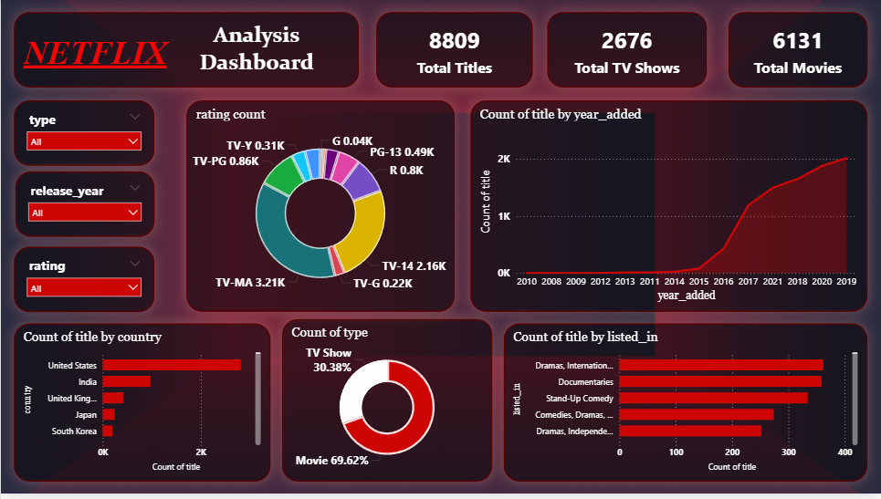

# 🎬 Netflix Content Analysis Dashboard – Data Analytics Report

## 📊 Project Overview
The **Netflix Content Analysis Dashboard** is a data analytics project built to explore and analyze Netflix’s global content library. The dashboard provides insights into content distribution, ratings, genres, release trends, and country contributions.

Using interactive visualizations, the dashboard helps understand how Netflix's content library has evolved and what type of content dominates the platform.

---

# 🎯 Objectives

The main goals of this project are:

- Analyze the **distribution of Movies and TV Shows**
- Understand **Netflix content growth over time**
- Identify **popular genres available on Netflix**
- Study **content rating distribution**
- Analyze **country-wise contribution of Netflix titles**

---

# 🛠 Tools & Technologies

- **Power BI** – Data visualization and dashboard creation  
- **Power Query** – Data cleaning and transformation  
- **DAX (Data Analysis Expressions)** – Data modeling and calculations  
- **Dataset** – Netflix Movies & TV Shows Dataset  

---

# 📌 Key Performance Indicators (KPIs)

| Metric | Value |
|------|------|
| Total Titles | **8809** |
| Total TV Shows | **2676** |
| Total Movies | **6131** |

These KPIs provide a quick summary of Netflix's total content available in the dataset.

---

# 📈 Dashboard Analysis & Insights

## 1️⃣ Content Type Distribution

| Content Type | Percentage |
|--------------|------------|
| Movies | **69.62%** |
| TV Shows | **30.38%** |

**Insight:**  
Movies dominate Netflix’s content library, representing nearly **70% of all available titles**, while TV Shows account for approximately **30%**.

---

## 2️⃣ Rating Distribution

The rating distribution chart shows how Netflix categorizes its content based on audience age groups.

Major ratings include:

| Rating | Titles |
|------|------|
| TV-MA | 3.21K |
| TV-14 | 2.16K |
| R | 0.80K |
| TV-PG | 0.86K |
| PG-13 | 0.49K |
| Others | Small proportion |

**Insight:**  
Most Netflix content falls under **TV-MA and TV-14 ratings**, indicating that the platform mainly targets **teen and mature audiences**.

---

## 3️⃣ Content Growth Over Time

The **Titles Added by Year** line chart shows Netflix’s content expansion.

Key observations:

- Content growth remained relatively low before **2015**
- A rapid increase occurred after **2016**
- The highest number of titles were added between **2018 and 2020**

**Insight:**  
Netflix significantly expanded its content library during the **late 2010s**, reflecting its global expansion strategy.

---

## 4️⃣ Country-wise Content Distribution

The bar chart shows the countries that contribute the most titles to Netflix.

Top contributing countries include:

1. **United States**
2. **India**
3. **United Kingdom**
4. **Japan**
5. **South Korea**

**Insight:**  
The **United States dominates Netflix production**, while **India and Asian countries** are increasingly contributing more content.

---

## 5️⃣ Genre Distribution

The genre analysis identifies the most common content categories on Netflix.

Top genres include:

- **Dramas & International Movies**
- **Documentaries**
- **Stand-Up Comedy**
- **Comedies & Dramas**
- **Independent Dramas**

**Insight:**  
Drama-based content is the most dominant genre in the Netflix dataset.

---

# 🎛 Dashboard Filters

The dashboard provides interactive filters for deeper exploration:

- **Type (Movie / TV Show)**
- **Release Year**
- **Rating**

These filters allow users to analyze specific segments of Netflix content.

---

# 📊 Key Findings

- Netflix hosts **over 8800 titles** in the dataset.
- **Movies dominate the platform**, making up nearly **70% of total content**.
- **TV-MA and TV-14** are the most common content ratings.
- Netflix saw **rapid content growth after 2016**.
- The **United States produces the majority of Netflix content**.
- **Drama and international content are the most common genres**.

---

# 🚀 Conclusion

The **Netflix Content Analysis Dashboard** demonstrates how data analytics can be used to understand streaming platform trends.

By analyzing Netflix content data, we can observe:

- Content distribution across movies and TV shows
- Audience targeting through ratings
- Geographic distribution of productions
- Popular genres among viewers

These insights can help streaming platforms improve **content strategy, audience targeting, and platform growth**.

## 📷 Dashboard Preview

